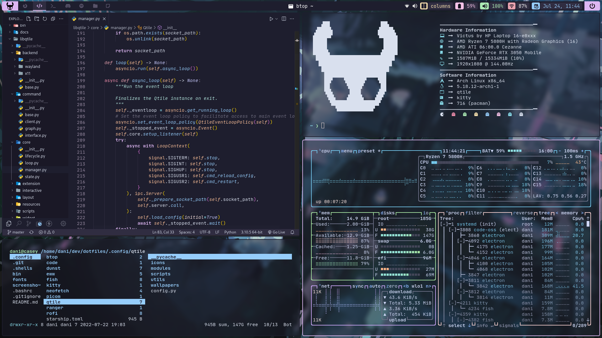

# Dani's dotfiles
My personal dotfiles, currently running Arch with qtile. With some inspiration from Hollow Knight!

Note: these dots are intended for my setup. You can use and modify them freely, but you might 
need to make some modifications specific to your system. Fell free to ask any questions!

## Info
- OS: Arch Linux 
- WM: [Qtile](https://github.com/qtile/qtile) with [qtile-extras](https://github.com/elParaguayo/qtile-extras)
- Terminal: kitty
- Shell: fish
- Bar: Qtile's bar
- Launcher & powermenu: [Rofi](https://github.com/davatorium/rofi)
- Browser: Firefox
- Fonts: JetBrainsMono [Nerd Font](https://github.com/ryanoasis/nerd-fonts) for general text and [Font Awesome 6 Free](https://fontawesome.com/) for some bar icons. 
- Gtk: [Tokyo Night](https://github.com/koiosdev/Tokyo-Night-Linux/tree/master/usr/share/themes/TokyoNight)
- File manager: Nautilus & Ranger
- Editors: [Nvchad neovim](https://github.com/NvChad/NvChad), VSCode
- Fetch: custom neofetch 
- Compositor: [Picom (Jonaburg fork)](https://github.com/jonaburg/picom)
- Dashboard: [eww](https://github.com/elkowar/eww) config by [rxyhn](https://github.com/rxyhn/bspdots)
- Colorscheme: [Catppuccin](https://github.com/catppuccin/catppuccin)

### Other
- The Material Design Icons font is needed: paru -S ttf-material-design-icons-extended

## Screenshots

